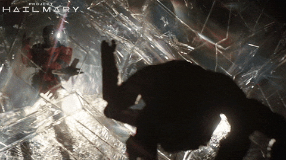

# Roki

This is Roki. Named after the alien from *Project Hail Mary* because that little guy is the best companion ever written. Roki is an AI desktop companion that lives in your system tray, watches your screen, and helps you out when you need it.

Press a shortcut, grab a screenshot, send it to an AI, get an answer. Simple.



---

## Credits

This project is a cross-platform port of [Clicky](https://github.com/farzaa/clicky) by [Farza](https://x.com/farzatv). Clicky was the original macOS AI companion that inspired all of this. Roki rebuilds those same ideas for Windows.

Go check out Clicky at [heyclicky.com](https://www.heyclicky.com/). Farza's a genius, I'm just copyin' him.

Original Clicky is MIT-licensed at [github.com/farzaa/clicky](https://github.com/farzaa/clicky).

---

## How it works

1. Hit `Ctrl+Shift+Space` or click the tray icon
2. Roki screenshots your monitors
3. Sends them to an AI model with whatever you asked
4. Streams the answer back in a little dark panel

That's it. You can swap between Claude, GPT-4o, Gemini, OpenRouter, or run Ollama locally if you're into that sort of thing.

---

## Get started with Claude Code

The fastest way to get this running:

```bash
git clone https://github.com/your-org/roki.git
cd roki
bun install
cd apps/desktop
cargo tauri dev
```

If you run into issues, Rust is probably crying about something. Make sure you've got the MSYS2 mingw64 toolchain on your PATH (`C:\msys64\mingw64\bin`). Windows things.

### API keys

Throw 'em in the engine constructor:

```typescript
const engine = new RokiEngine('anthropic', {
  apiKey: 'sk-ant-...',
  model: 'claude-sonnet-4-20250514',
})
```

Supported providers:

- Anthropic (Claude) -- `ANTHROPIC_API_KEY`
- OpenAI (GPT-4o) -- `OPENAI_API_KEY`
- Google (Gemini 2.0 Flash) -- `GEMINI_API_KEY`
- OpenRouter -- `OPENROUTER_API_KEY`
- Ollama -- nothing needed, runs locally

---

## Development

```bash
bun run typecheck     # checks all 10 packages
cd apps/desktop
cargo check           # checks the Rust side
```

### What's built

| Part | Status |
|------|--------|
| AI providers (5 of 'em) | Done |
| State machine (RokiEngine) | Done |
| Screen capture | Done |
| Tauri tray app + panel | Done |
| Voice pipeline | Workin' on it |
| TTS + element pointing | Soon |
| Settings + polish | Soon |

---

## Contributing

PRs welcome. The codebase is pretty straightforward:

- `apps/desktop/src-tauri/src/` -- Rust backend (shortcuts, capture, overlay)
- `apps/desktop/src/` -- React frontend (panel, IPC bridge)
- `packages/` -- TypeScript packages (AI providers, engine, config, types)

Before you PR, run `bun run typecheck` and `cargo check`. Keep commits clean.

---

## License

MIT. Originally by [Farza](https://x.com/farzatv), now yours too.

Go build something cool.
